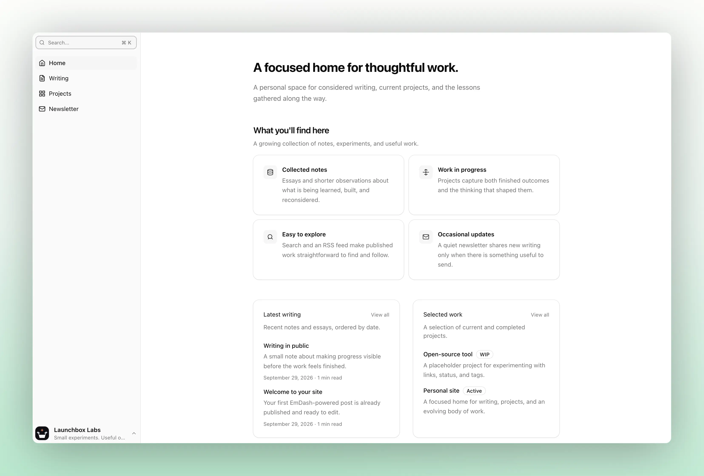

# minastro

<picture>
  <source media="(prefers-color-scheme: dark)" srcset="images/minastro-dark.webp">
  <source media="(prefers-color-scheme: light)" srcset="images/minastro-light.webp">
  
</picture>

A personal-site theme built with Astro and [EmDash](https://emdashcms.com), running server-side on Cloudflare Workers. EmDash is a Git-free CMS that stores your content in Cloudflare D1 and media in R2, so posts, projects, pages, and settings are all authored from the built-in admin at `/_emdash/admin`. Out of the box you get a blog, a project portfolio, CMS-managed pages, search, RSS, comments, and an optional newsletter.

## Quick start

Requires [Bun](https://bun.sh) and Node.js 22.12.0 or later on an even-numbered release line.

```sh
bun create astro@latest my-site --template github:frankievalentine/minastro --no-ai
cd my-site
bun install
bun run cf:dev
```

`create-astro` copies the theme into a new standalone site project that you own and edit, separate from the upstream template source. `npx create-astro@latest my-site --template github:frankievalentine/minastro --no-ai` works the same way if you prefer npm. Keep `--no-ai`: it keeps Minastro's own `AGENTS.md` and bundled skill guidance instead of letting `create-astro` overwrite them with its generic AI stub.

`bun run cf:dev` builds the site, runs the Worker locally on `http://localhost:8787` with simulated D1/R2/KV bindings, and opens the authorized setup page for you (clipboard fallback). Its temporary local credential stays valid until the local Worker restarts. There is nothing to configure first: no Cloudflare account, no domain, and no secrets.

- Local content persists in `.wrangler/state` across restarts. To start over, delete only that directory; the next run re-applies the seed.
- `.dev.vars` is optional. Use it only to pin your own local secrets or to try local options such as the newsletter. While that file exists, `cf:dev` stops minting its own secret, so it must hold a usable `EMDASH_BOOTSTRAP_SECRET` (32 bytes or more) and you open the setup URL with that value yourself; delete the file to get the automatic handoff back.
- Passkeys registered on localhost do not transfer to production. Register your production passkey later on your final deployed hostname.
- On the first setup screen you choose whether to include sample content. Both choices are supported; either way the schema, initial settings, and navigation are applied.

`bun run dev` runs Astro alone and does not provide the bindings EmDash needs, so use `cf:dev` for full-stack work.

## Make the site yours

Content is edited in the admin. Sign in at `/_emdash/admin` to write posts and projects, add pages, and manage tags, comments, and site settings. Site identity (title, tagline, logo) and the primary navigation are owned by the CMS, not by the repository, so they are changed there.

The repository holds the rest:

- `src/site.config.ts` — presentation values with no EmDash equivalent: avatar, bio, location, roles, social links, and the optional analytics and newsletter integration settings.
- `.emdash/seed.json` — the schema and starter content applied to a fresh, empty database. After a content-model change, edit the seed, then run `bun run types:generate` and commit the regenerated `.emdash/types.ts` and `.emdash/schema.json` with it.

EmDash is the only source of runtime content, and there are no local-content fallbacks for CMS routes: a misconfigured route fails visibly instead of rendering something else. A changed seed never mutates an existing site; it only initializes an empty database.

## Production deployment

Deployment is optional: you can develop locally indefinitely. This is the base flow; [docs/manual-deployment.md](docs/manual-deployment.md) is the full runbook and [docs/operations.md](docs/operations.md) covers backups, restores, and recovery.

Have ready: a Cloudflare account you can sign in to, a final HTTPS hostname (`https://example.com`) in an active Cloudflare DNS zone that account owns, and your explicit approval to create the resources, attach the domain, and deploy. Setup discovers or asks for the account and shows it in the printed plan, so you review it there; pass `--account <id>` only if you want to pin it up front.

1. Sign in to Cloudflare with Wrangler:

   ```sh
   bunx wrangler login
   ```

2. Generate the encryption key and save the printed value as `EMDASH_ENCRYPTION_KEY` in your password manager:

   ```sh
   bunx emdash secrets generate
   ```

   Save this key before you deploy. An established site needs its original encryption key, so losing it is unrecoverable. Setup uploads the saved value for you after it has chosen the Worker name. If you prefer to set it yourself, do that only after the Worker exists and always with the approved name, `npx wrangler secret put EMDASH_ENCRYPTION_KEY --name <worker-name>`; a bare command targets the placeholder `minastro-template` Worker and is wrong.

   Generate a first-admin bootstrap secret and save it as `EMDASH_BOOTSTRAP_SECRET`:

   ```sh
   printf '%s\n' "$(openssl rand -base64 32 | tr '+/' '-_' | tr -d '=\n')"
   ```

3. Provision the site:

   ```sh
   bun run cloudflare:setup
   ```

   One interactive run covers the whole deployment. Setup resolves your Cloudflare account and authentication from the Wrangler login and your `wrangler.jsonc`, asks for the Worker name (default `my-site`) and a canonical HTTPS origin if `src/site.config.ts` does not already hold one, prepares the first-admin bootstrap handoff, and prints a single plan summary covering the account, resources, custom domain, deployment, and cron triggers. Nothing is created until you approve that plan. The D1, R2, and KV names are derived from the Worker name (defaults `<worker>-db`, `<worker>-media`, `<worker>-sessions`), so there is nothing else to name. Setup then prompts for each saved secret through hidden input, so nothing is echoed or written to disk. Run it from the scaffolded site directory in a real interactive terminal.

   If no Wrangler login is found, setup offers to sign you in; that guided login writes or refreshes your Wrangler session outside the project, which is expected. An account-scoped API token is the alternative. Both are described in [docs/manual-deployment.md](docs/manual-deployment.md), and setup never stores credentials in your project.

4. Finish on the final origin. Setup opens the bootstrap URL for `/_emdash/admin/setup` on your canonical hostname; if the browser does not open, it copies the URL to your clipboard. That link stays usable until you remove the secret below. Register your production passkey there, never on a `*.workers.dev` origin, because passkeys are bound to the exact origin.

   Once the first administrator is registered, revoke the bootstrap secret from the scaffolded directory:

   ```sh
   bunx wrangler secret delete EMDASH_BOOTSTRAP_SECRET --name <worker-name>
   ```

   Later deploys are `bun run cf:deploy`, which rebuilds the Astro SSR output before Wrangler runs. Never deploy with a bare `wrangler deploy`; it skips that build.

### Analytics

Cloudflare Web Analytics is the recommended production default and needs nothing in this repository: enable it in the Cloudflare dashboard for the zone once the site is live on its custom domain, and Cloudflare injects the beacon. Keep `analytics.enabled: false` in `src/site.config.ts` for that option. For another provider, or to turn analytics off, see [docs/analytics.md](docs/analytics.md).

### Newsletter

The newsletter page is visible by default, but signup stays disabled until you opt in to its integration (an onboarded Email Sending domain, a Turnstile site key and secret, a rate-limit namespace ID, and an admin token). Setup is base-only unless you pass `bun run cloudflare:setup --newsletter`, so if you are not onboarding a sending domain yet, leave it off. See [docs/newsletter.md](docs/newsletter.md) for architecture, configuration, and operations.

## Set up with an agent

Optional. Open a coding agent in your scaffolded site directory and paste this:

```text
Set up my Minastro site from this scaffold. Read AGENTS.md first, then the bundled
EmDash skill at .agents/skills/building-emdash-site/SKILL.md. Work inside this
scaffolded project only; never edit or push to the upstream template source.
Run bun install, bun run check, bun run seed:validate, and bun run build locally.
Keep src/site.config.ts at its local default until I give you a production
hostname, and do not create Cloudflare resources, secrets, or deployments without
my explicit approval.
```

You remain responsible for account choice, resource approval, domain ownership, passkey registration, and any optional third-party credentials.

## Commands

| Command | Action |
| --- | --- |
| `bun run cf:dev` | Build and run the Worker locally with simulated D1/R2/KV bindings |
| `bun run dev` | Astro-only frontend dev server |
| `bun run build` | Build production SSR output |
| `bun run check` | Type-check and lint |
| `bun run seed:validate` | Validate `.emdash/seed.json` |
| `bun run types:generate` | Regenerate `.emdash/types.ts` and `.emdash/schema.json` |
| `bun run cloudflare:setup` | Provision and deploy the configured Worker once |
| `bun run cf:deploy` | Deploy an already configured Worker |
| `bun run smoke:worker` | Isolated local Worker setup/runtime smoke test; no credentials needed |
| `bun run preview:setup` | Preview the setup terminal output and run a local build; no Cloudflare access |

Test suites: `bun run test:setup` for resumable provisioning and `bun run test:newsletter` for newsletter behavior. CI and the isolated local Worker smoke test are documented in [docs/ci.md](docs/ci.md).

## Learn more

- [docs/manual-deployment.md](docs/manual-deployment.md) — deploy without an agent.
- [docs/operations.md](docs/operations.md) — backups, restores, staging isolation, post-cutover checks, passkey recovery.
- [docs/newsletter.md](docs/newsletter.md) — newsletter architecture and operations.
- [docs/analytics.md](docs/analytics.md) — Cloudflare Web Analytics or a custom provider.
- [AGENTS.md](AGENTS.md) — provisioning requirements, architecture, and agent guidance.
